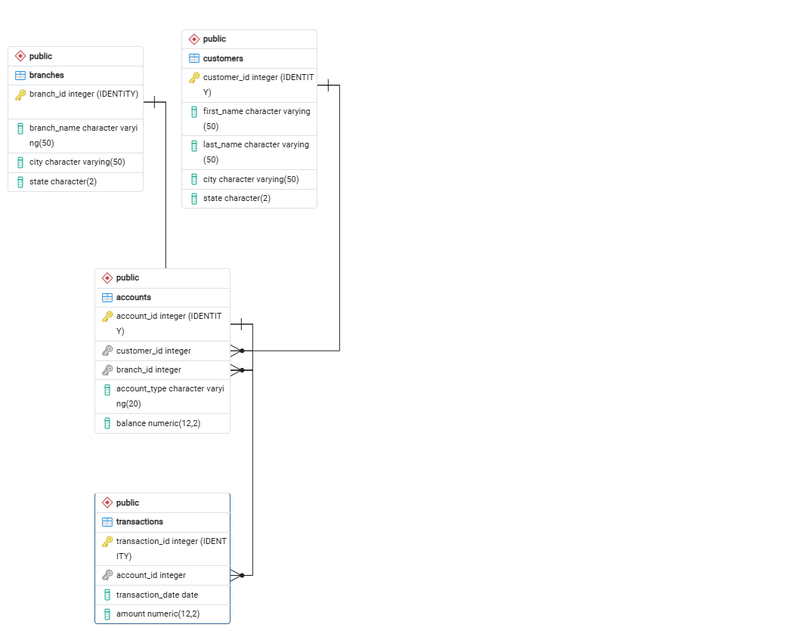

# MIS 443 – Finance Analysis with PostgreSQL

A practical PostgreSQL project based on a **retail banking database**.  
This repository is designed for students who want to understand the database structure, practise the examination questions independently, and then compare their work with a completed SQL solution.

## Project Overview

The database represents a retail bank that manages **customers, branches, accounts, and financial transactions**. The analysis focuses on practical management questions related to customer portfolios, account balances, branch performance, and transaction activity.

The project progresses from basic SQL to more advanced analytical techniques, including:

- Filtering and sorting
- Aggregate functions
- Multi-table joins
- Subqueries
- Tie-aware maximum queries
- Window functions
- Common Table Expressions (CTEs)

## What You Can Practise

- Creating and validating a PostgreSQL relational database
- Using `WHERE`, `ORDER BY`, and aliases
- Using `COUNT`, `SUM`, `AVG`, `MIN`, and `MAX`
- Using `INNER JOIN` and `LEFT JOIN`
- Grouping data with `GROUP BY`
- Solving business questions with subqueries
- Returning tied maximum values
- Ranking customers with `DENSE_RANK()`
- Building multi-step analysis with a CTE
- Translating finance and management questions into SQL

## Database at a Glance

| Table | Purpose |
|---|---|
| `customers` | Stores customer names and locations |
| `branches` | Stores bank branch names and locations |
| `accounts` | Stores account ownership, branch assignment, account type, and current balance |
| `transactions` | Stores transaction dates and transaction amounts |

Positive account balances represent funds held by customers. Negative Credit Card balances represent amounts owed. Positive transaction amounts are credits, while negative transaction amounts are debits.

## Entity–Relationship Diagram



The main relationships are:

- `accounts.customer_id` → `customers.customer_id`
- `accounts.branch_id` → `branches.branch_id`
- `transactions.account_id` → `accounts.account_id`

These relationships create three one-to-many relationships:

- **Customer → Accounts**
- **Branch → Accounts**
- **Account → Transactions**

## Analysis Questions

The completed project answers **12 analysis tasks across 6 examination questions**.

| Area | Examples |
|---|---|
| Customer overview | New York customer list, total number of accounts |
| Balance analysis | Total Checking balance, Los Angeles customer portfolios |
| Branch performance | Highest average balance, highest total balance |
| Customer value | Highest-balance account, highest combined deposit balance |
| Activity analysis | Most active customers, most active branches |
| Advanced SQL | Customer balance ranking and CTE-based branch analysis |

## Selected Results

Some example findings from the completed analysis include:

- **Total accounts:** 15
- **Total Checking balance:** 31,000.00
- **Largest customer portfolio:** Michael Lee – 60,000.00
- **Highest single account balance:** Michael Lee – Savings – 50,000.00
- **Highest average branch balance:** North Beach – 30,000.00
- **Highest total branch balance:** North Beach – 60,000.00
- **Most active customers:** Jane Doe and Alice Johnson – 4 transactions each
- **Most active branches:** Main and South Bay – 4 transactions each

## Repository Structure

```text
MIS443-Finance-Analysis-PostgreSQL/
│
├── codes/
│   ├── MIS443_Finance_PostgreSQL.sql
│   └── MIS443_Finance_Analysis_Solutions.sql
│
├── questionnaire/
│   ├── Mock Test.docx
│   └── MIS443_Finance_Final_Exam_Skeleton.sql
│
├── report/
│   └── MIS443_DoanPhanMinhVu_Finance_Analysis_Report.docx
│
├── Entity_Relationship_Diagram.png
└── README.md
```

A separate `data/` folder is not required because `MIS443_Finance_PostgreSQL.sql` already creates the database tables and inserts the full practice dataset.

## Practice Materials – Try the Test Yourself

The `questionnaire/` folder is provided for anyone who wants to attempt the exercise before looking at the completed solution.

It contains:

1. **Mock Test.docx** – the examination questions and task requirements.
2. **MIS443_Finance_Final_Exam_Skeleton.sql** – a starter SQL file where you can write your own answers.

You can open or download the files directly:

- [Open / Download Mock Test.docx](questionnaire/Mock%20Test.docx)
- [Open / Download MIS443_Finance_Final_Exam_Skeleton.sql](questionnaire/MIS443_Finance_Final_Exam_Skeleton.sql)

### Suggested Practice Workflow

1. Download or clone this repository.
2. Open PostgreSQL and pgAdmin 4.
3. Create a new database.
4. Run `codes/MIS443_Finance_PostgreSQL.sql` to create the tables and load the dataset.
5. Open `questionnaire/Mock Test.docx`.
6. Use `questionnaire/MIS443_Finance_Final_Exam_Skeleton.sql` to write your own queries.
7. Run and check your results in pgAdmin.
8. Only after finishing, compare your work with `codes/MIS443_Finance_Analysis_Solutions.sql`.
9. Open the report for screenshots, explanations, and business interpretation.

## How to Run the Completed Project

1. Open PostgreSQL and pgAdmin 4.
2. Create a new database.
3. Connect to the new database.
4. Run `codes/MIS443_Finance_PostgreSQL.sql`.
5. Confirm that the following tables are available:
   - `customers`
   - `branches`
   - `accounts`
   - `transactions`
6. Run `codes/MIS443_Finance_Analysis_Solutions.sql`.
7. Compare the SQL outputs with the screenshots and explanations in the report.

## Why This Repository Is Useful

This repository can be used in two different ways:

**For practice:**  
Use the files in `questionnaire/` and try to solve the questions independently.

**For reference:**  
Review the completed SQL file and report to understand different approaches to finance-oriented SQL analysis.

## Tools Used

- PostgreSQL
- pgAdmin 4
- SQL
- Microsoft Word
- GitHub

## Author

**Doan Phan Minh Vu**  
Student ID: **2232300049**  
GitHub: [kenphan303](https://github.com/kenphan303)

---

*Educational project for MIS 443 – Business Data Management.*
